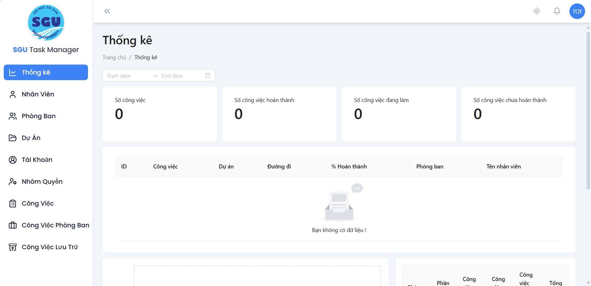

<br />
<div align="center">
    
    <br />
    <br />
    <p>
        Web quản lý công việc phòng ban sử dụng React, Django.
    </p>
</div>

<br />



[Live View](https://project-management-frontend-snowy.vercel.app/)

### 🔐 Tài khoản demo

Bạn có thể đăng nhập để trải nghiệm:
Email: chantruog753@gmail.com
Mật khẩu: 123456

## 🗒️ Mục lục

1. [💬 Giới thiệu](#giới-thiệu)
2. [🛠️ Công nghệ sử dụng](#công-nghệ-sử-dụng)
3. [✨ Tính năng chính](#tính-năng-chính)
4. [🚀 Khởi chạy dự án](#khởi-chạy-dự-án)

## 💬 Giới thiệu

Dự án **Web quản lý công việc phòng ban** là một ứng dụng giúp quản lý công việc, tiến độ và trao đổi giữa các thành viên trong công ty hoặc tổ chức. Giao diện hiện đại, dễ sử dụng, có hỗ trợ real-time thông qua **Django Channels**. Hệ thống chia rõ vai trò người dùng, bảo mật tốt, và có khả năng mở rộng linh hoạt.

## 🛠️ Công nghệ sử dụng

- 💻 Frontend:
  - [ReactJS](https://reactjs.org/)
  - [TailwindCSS](https://tailwindcss.com/)
  - [Ant Design](https://ant.design/)
  - [React Router](https://reactrouter.com/)
  - [Vite](https://vitejs.dev/)

- 🖥️ Backend:
  - [Django](https://www.djangoproject.com/)
  - [Django REST Framework](https://www.django-rest-framework.org/)
  - [Django Channels](https://channels.readthedocs.io/en/stable/)

- ☁️ Triển khai:
  - Backend: [AWS EC2](https://aws.amazon.com/ec2/)
  - Frontend: [Vercel](https://vercel.com/)

## ✨ Tính năng chính

- ✅ Quản lý phòng ban, nhân viên và phân công công việc
- ✅ Giao diện hiện đại, responsive
- ✅ Tích hợp websocket (Django Channels) để cập nhật real-time
- ✅ Xác thực JWT và phân quyền người dùng
- ✅ Thống kê và biểu đồ trực quan
- ✅ Tương tác nhanh qua UI thân thiện từ Ant Design

## 🚀 Khởi chạy dự án

### Backend (Django)
🔗 Mã nguồn: [GitHub - Django Backend](https://github.com/QgQ220903/ProjectManagement_Backend)
```bash
# Cài đặt virtual env
python -m venv env
source env/bin/activate  # macOS/Linux
env\Scripts\activate     # Windows

# Cài đặt dependencies
pip install -r requirements.txt

# Khởi chạy server
python manage.py migrate
python manage.py runserver
```
### Frontend (React)
```bash
# Cài đặt dependencies
npm install

# Chạy dev server
npm run dev
```

